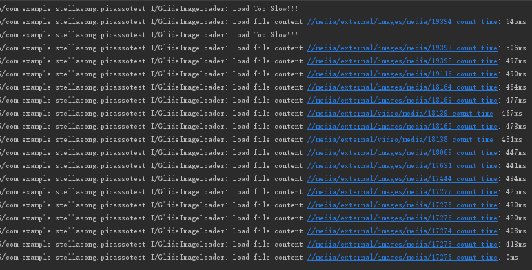

# demo检查Picasso图片加载器加载时间

## 环境
- 开发环境 Android Studio 3.0.1
- 运行环境 Android 5.0.2

## 操作方式
点击click按钮，跳转选择图片，log图片加载时长并提示加载过慢的图片

## 示例


## 使用库
- 加载器：Picasso
- 图片选择控件：VanGogh

## 计算代码
GlideImageLoader类
```
final long currentLoadStartTime = System.currentTimeMillis();
Picasso.get()
        .load(uri)
        .resize(resize, resize)
        .centerCrop()
        .into(imageView, new Callback() {
            @Override
            public void onSuccess() {
                long countTime = System.currentTimeMillis() - currentLoadStartTime;
                if (countTime >= 500)  Log.i(TAG, "Load Too Slow!!!");
                Log.i(TAG, "Load file " + uri.toString() + " count time: " + countTime);
            }

            @Override
            public void onError(Exception e) {
            }
        });
```
调用loadThumbnail函数时记录开始时间，图片加载成功时回调计算加载耗时